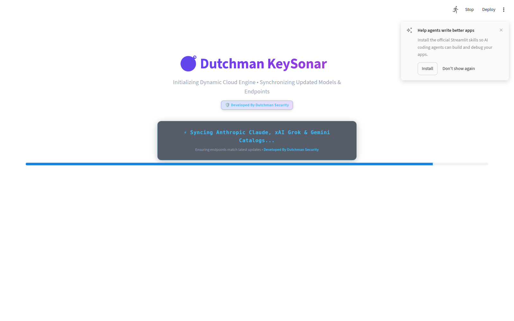
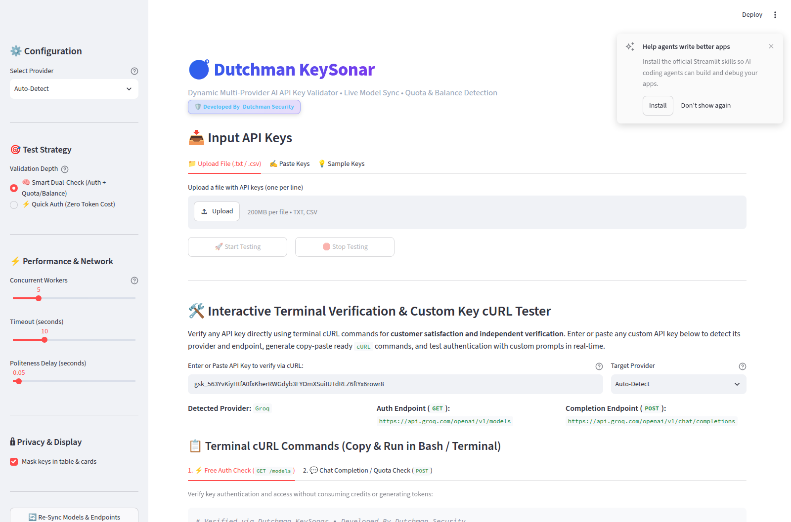
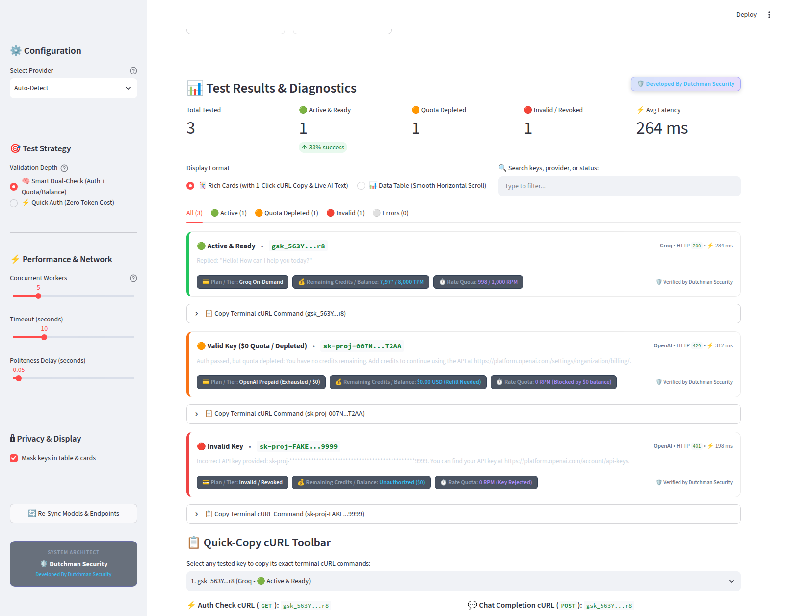
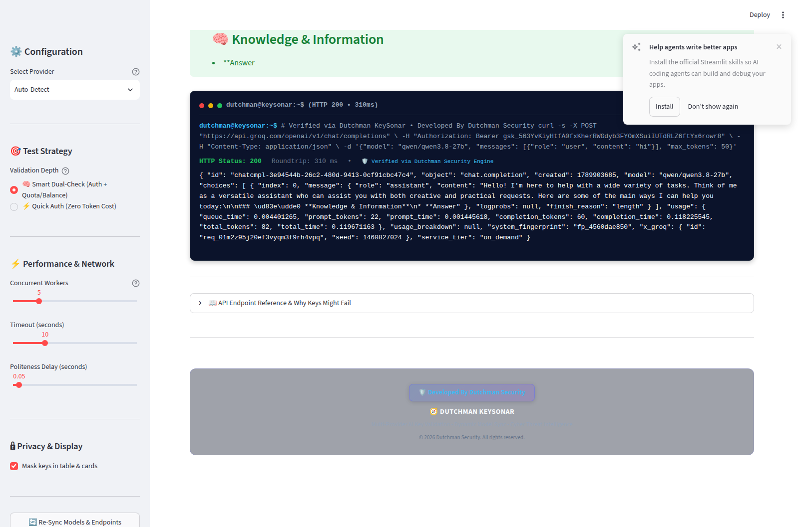

# 🧭 Dutchman KeySonar
### *Enterprise Multi-Provider AI API Key Validator, Quota Radar & Terminal Verification Suite*

<p align="center">
  
  
  
  
  
</p>

---

## 🛡️ Developed By Dutchman Security

**Dutchman KeySonar** is a cyber-reconnaissance and API diagnostic platform engineered for AI developers, security auditors, red-team researchers, and infrastructure engineers. It automates high-speed validation, quota extraction, subscription tier detection, and terminal verification across all major Artificial Intelligence cloud platforms.

Instead of manually crafting API calls or writing throwaway scripts, **Dutchman KeySonar** provides a real-time radar interface with live model synchronization, instant rate limit extraction, 1-click terminal cURL commands for customer verification, and an embedded terminal simulator.

---

## 📸 Interface Showcase & Visual Walkthrough

### 1. Dynamic 5-Second Cloud Sync
*On startup, Dutchman KeySonar initializes a 5-second dynamic synchronization cycle to fetch the latest models and endpoint specifications from active cloud providers.*



---

### 2. Central Reconnaissance Dashboard & Key Ingestion
*Intuitive batch key ingestion via file upload (`.txt`, `.csv`, `.key`), paste area with smart deduplication, or pre-built sample test bundles.*



---

### 3. Detailed Results, Subscription Tiers & cURL Generation
*Deep diagnostic cards displaying HTTP status codes, round-trip latency, subscription plans (e.g. Free Tier, On-Demand, Prepaid Exhausted), live remaining quota / token budgets, and 1-click copyable verification cURL commands.*



---

### 4. Interactive Terminal Simulator
*A browser-integrated Linux terminal simulator allowing users to execute authentic cURL commands against live model endpoints with custom prompts and inspect raw HTTP response headers.*



---

## ✨ Key Features

- ⚡ **Dynamic 5-Second Cloud Sync**:
  - Automatically queries live provider model endpoints upon boot to discover new and deprecated models in real-time.
  - Keeps provider configurations current without requiring codebase updates.

- 🔍 **Intelligent Auto-Detection Radar**:
  - Automatically classifies keys by architectural signature prefixes:
    - `gsk_` ➔ **Groq**
    - `sk-proj-` or `sk-` ➔ **OpenAI**
    - `xai-` ➔ **xAI (Grok)**
    - `sk-ant-` ➔ **Anthropic (Claude)**
    - `AIzaSy` ➔ **Google Gemini**
    - `sk-or-` ➔ **OpenRouter**
    - `deepseek-` ➔ **DeepSeek**

- 💳 **Plan, Usage Tier & Quota Intelligence**:
  - Differentiates between:
    - 🟢 **Active & Ready** (Authenticated and capable of token generation).
    - 🟠 **Quota Depleted ($0 Balance)** (Key is valid and authenticated, but blocked due to insufficient prepaid balance).
    - 🔴 **Invalid / Revoked** (Authentication failed, key does not exist or was deleted).
    - 🟡 **Rate Limited (429 TPM/RPM)** (Valid account, temporarily rate-capped).
  - Extracts HTTP response quota headers (e.g. `x-ratelimit-remaining-tokens`, `x-ratelimit-remaining-requests`, `anthropic-ratelimit-*`).

- 📋 **Terminal cURL Generator for Customer Satisfaction**:
  - Generates verified, reproducible `cURL` commands for both **Authentication Check** (`/models`) and **Live Inference** (`/chat/completions`).
  - Supports 1-click copying of both formatted multi-line bash commands and compact single-line commands for quick verification in native terminals.

- 💻 **Integrated Terminal Simulator**:
  - Execute live API calls directly inside the KeySonar web interface with real-time streaming output, latency metrics, and interactive prompt testing.

- 🔒 **Zero-Trust Security & Key Masking**:
  - All keys are sanitized and masked (`gsk_xxxx...xxxx`) in logs, tables, and metric summaries.
  - Zero persistence: No API keys are written to remote servers or third-party trackers.
  - Clean export options (`active_valid_keys.txt`, `all_authentic_keys.txt`, and full CSV diagnostic reports).

---

## 🌐 Supported Providers & Endpoints

| Provider | Authentication Check Endpoint | Chat / Inference Endpoint | Key Signature Pattern |
| :--- | :--- | :--- | :--- |
| **Groq Cloud** | `https://api.groq.com/openai/v1/models` | `https://api.groq.com/openai/v1/chat/completions` | `gsk_*` |
| **OpenAI** | `https://api.openai.com/v1/models` | `https://api.openai.com/v1/chat/completions` | `sk-proj-*`, `sk-*` |
| **xAI (Grok)** | `https://api.x.ai/v1/models` | `https://api.x.ai/v1/chat/completions` | `xai-*` |
| **Anthropic** | `https://api.anthropic.com/v1/models` | `https://api.anthropic.com/v1/messages` | `sk-ant-*` |
| **Google Gemini** | `https://generativelanguage.googleapis.com/v1beta/models` | `https://generativelanguage.googleapis.com/v1beta/models/{model}:generateContent` | `AIzaSy*` |
| **OpenRouter** | `https://openrouter.ai/api/v1/models` | `https://openrouter.ai/api/v1/chat/completions` | `sk-or-*` |
| **DeepSeek** | `https://api.deepseek.com/models` | `https://api.deepseek.com/chat/completions` | `sk-*` |
| **Custom Compatible** | User-defined base URL | User-defined chat URL | Custom |

---

## 🚀 Quickstart & Installation

### Prerequisites
- **Python 3.10** or higher
- **Git**

### 1. Clone the Repository
```bash
git clone https://github.com/dutchman-security/KeySonar.git
cd KeySonar
```

### 2. Create and Activate Virtual Environment
```bash
# Linux / macOS
python3 -m venv venv
source venv/bin/activate

# Windows
python -m venv venv
venv\Scripts\activate
```

### 3. Install Dependencies
```bash
pip install --upgrade pip
pip install -r requirements.txt
```

### 4. Launch Dutchman KeySonar
```bash
streamlit run keysonar.py
```
*The dashboard will automatically open in your browser at `http://localhost:8501`.*

---

## 📖 Step-by-Step Usage

### Testing Keys via Web UI
1. **Choose Provider**: Select `Auto-Detect (Recommended)` to automatically determine the provider from key prefixes, or choose a specific provider from the dropdown.
2. **Ingest Keys**:
   - **Upload File**: Drop a `.txt`, `.csv`, or `.key` file containing one key per line.
   - **Paste Keys**: Paste keys directly into the text area.
3. **Configure Options**:
   - Check **Run Live Chat Completion Probe** to test actual text generation.
   - Adjust request timeout and maximum thread concurrency in the sidebar.
4. **Initiate Scan**: Click **`🚀 Launch Sonar Scan`**.
5. **Inspect & Export**:
   - View high-level KPIs (Total, Active, Depleted, Invalid).
   - Scroll horizontally through the detailed diagnostics table.
   - Copy terminal cURL commands to verify keys externally.
   - Download sanitized lists of active keys or full CSV audit logs.

### Offline / Preview Mode
To preview the dashboard layout with simulated test data without consuming tokens:
```bash
# In your browser, append ?demo=true:
http://localhost:8501/?demo=true
```

---

## 💻 Manual Terminal Verification Guide

You can copy the generated cURL commands directly into your local Linux, macOS, or WSL terminal.

### Groq Example
```bash
# 1. Check Authentication & List Models
curl -s -X GET "https://api.groq.com/openai/v1/models" \
  -H "Authorization: Bearer YOUR_GROQ_API_KEY"

# 2. Test Live Token Generation
curl -s -X POST "https://api.groq.com/openai/v1/chat/completions" \
  -H "Authorization: Bearer YOUR_GROQ_API_KEY" \
  -H "Content-Type: application/json" \
  -d '{"model": "qwen/qwen3.8-27b", "messages": [{"role": "user", "content": "hi"}], "max_tokens": 50}'
```

### OpenAI Example
```bash
# 1. Check Authentication & List Models
curl -s -X GET "https://api.openai.com/v1/models" \
  -H "Authorization: Bearer YOUR_OPENAI_API_KEY"

# 2. Test Live Token Generation
curl -s -X POST "https://api.openai.com/v1/chat/completions" \
  -H "Authorization: Bearer YOUR_OPENAI_API_KEY" \
  -H "Content-Type: application/json" \
  -d '{"model": "gpt-4o-mini", "messages": [{"role": "user", "content": "hi"}], "max_tokens": 50}'
```

---

## 🔒 Security & Privacy Notice

- **Dutchman KeySonar** does **NOT** log, store, or transmit your secret API keys to external servers.
- Requests originate solely from your local machine directly to the official provider endpoints over TLS/HTTPS.
- Never commit actual API keys to Git repositories. Always use `.env` files or secure secret stores.

---

## 🛡️ Author & Credits

**Dutchman KeySonar** is designed and maintained by **Dutchman Security**.

- **Organization**: [Dutchman Security](https://github.com/dutchman-security)
- **Repository**: [https://github.com/dutchman-security/KeySonar](https://github.com/dutchman-security/KeySonar)

---

## 📄 License

This project is licensed under the **MIT License** - see the [LICENSE](LICENSE) file for details.
